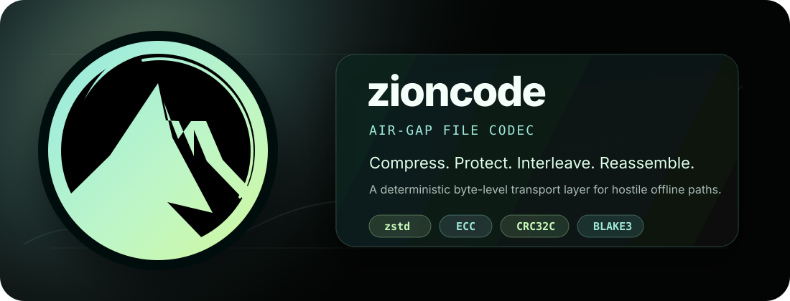
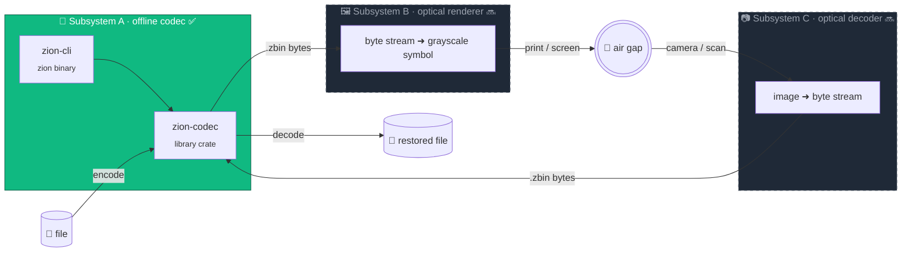
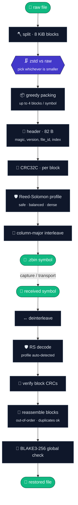

<p align="center">
  
</p>

<h1 align="center">zioncode</h1>

<p align="center">
  <b>Encode files into resilient offline symbols. Decode them back with strong integrity checks.</b>
  <br>
  <sub>Built for air-gapped transfer, noisy capture paths, and explicit recovery diagnostics.</sub>
</p>

<p align="center">
  <a href="rust-toolchain.toml"></a>
  <a href="Cargo.toml"></a>
  <a href="LICENSE"></a>
  
  
</p>

<p align="center">
  <a href="https://github.com/gabrielmaialva33/zioncode/stargazers"></a>
  <a href="https://github.com/gabrielmaialva33/zioncode/issues"></a>
  <a href="https://github.com/gabrielmaialva33/zioncode/commits/master"></a>
  <a href="CONTRIBUTING.md"></a>
</p>

---

## 📖 Table of Contents

- [🎯 What is zioncode?](#-what-is-zioncode)
- [✨ Highlights](#-highlights)
- [🧭 When to use it](#-when-to-use-it)
- [🏗️ Architecture](#-architecture)
- [🚀 Quick Start](#-quick-start)
- [🧬 Codec Pipeline](#-codec-pipeline)
- [🛡️ Layered Robustness](#-layered-robustness)
- [🗺️ Roadmap](#-roadmap)
- [🧪 Testing & Hardening](#-testing--hardening)
- [📐 Format Contract](#-format-contract)
- [🤝 Contributing](#-contributing)
- [📜 License](#-license)

---

## 🎯 What is zioncode?

`zioncode` is a Rust codec for **moving files through hostile offline channels** — think air-gapped machines, printed paper, camera capture, or any path where the bytes leaving origin are not the bytes arriving at destination.

The v1 repository ships **Subsystem A: the offline byte codec**. It turns a file into one or more self-contained `.zbin` symbols with compression, error-correction, interleaving, per-block and global integrity checks, and a typed reassembler that reports *which* blocks are missing instead of just failing.

Optical rendering (Subsystem B) and camera decoding (Subsystem C) are intentionally separate future layers — the codec is an independently deliverable unit.

```text
file bytes ─▶ zion-codec ─▶ .zbin symbols ─▶ [optical transport] ─▶ captured symbols ─▶ zion-codec ─▶ restored file
```

---

## ✨ Highlights

- 🚫 **`#![forbid(unsafe_code)]`** — pure safe Rust, clippy pedantic enabled
- 🗜️ **zstd per block** with raw fallback when compression does not pay off
- 🛡️ **Reed–Solomon profiles** in GF(256) — `safe`, `balanced`, and `dense` density modes
- 🧵 **Column-major interleaving** — burst errors spread across codewords
- ✅ **CRC32C per block** + **BLAKE3-256 global hash** — layered integrity
- 🧩 **Out-of-order symbol reassembly** with typed error model (missing / duplicate / divergent)
- 🔬 **Forensic mode** — recover the structure even when the global hash diverges
- 🧪 **Fuzz-hardened** decoder (`cargo-fuzz`, 30M+ execs, zero panics)
- 📦 **Frozen v1 wire format** — spec lives next to the code

---

## 🧭 When to use it

**✅ Good fit**
- Air-gapped transfer between networkless machines
- Transport over media that may corrupt, truncate, or duplicate bytes
- Pipelines that need to report *why* something could not be recovered
- Long-term archival where you want independent per-chunk integrity

**❌ Not a fit**
- Real-time streaming (this is a batch codec)
- Encryption at rest — integrity ≠ confidentiality; layer a cipher on top if needed
- Tiny payloads where ECC overhead dominates — you'll want a plain hash

---

## 🏗️ Architecture



| Path                                         | Responsibility                                                     | Status |
|----------------------------------------------|--------------------------------------------------------------------|--------|
| [`zion-codec/`](zion-codec/)                 | Core library: format, compression, ECC, encode, decode, reassembly | ✅ v1   |
| [`zion-cli/`](zion-cli/)                     | Thin `zion` CLI around the library                                 | ✅ v1   |
| [`zion-codec/tests/`](zion-codec/tests/)     | Roundtrip + property-based invariants                              | ✅ v1   |
| [`zion-codec/benches/`](zion-codec/benches/) | Criterion benchmarks for hot paths                                 | ✅ v1   |
| [`fuzz/`](fuzz/)                             | `cargo-fuzz` targets (nightly)                                     | ✅ v1   |
| [`docs/superpowers/specs/`](docs/)           | Source of truth for v1 wire format                                 | ✅ v1   |

---

## 🚀 Quick Start

<details open>
<summary><b>📦 Encode a file into symbols</b></summary>

```sh
cargo run -p zion-cli -- encode ./input.bin --output-prefix ./out/input
# ▶ writes ./out/input_000.zbin, ./out/input_001.zbin, ...
```

By default, the CLI chooses an automatic `K` that minimizes emitted bytes for the selected profile. Override with `--k` when a renderer needs a fixed physical symbol size.

Profiles:

```sh
--profile safe      # RS(255,223), strongest default profile
--profile balanced  # RS(255,239), lower overhead, less correction
--profile dense     # RS(255,247), lowest overhead, smallest correction budget
```

Tune compression with `--zstd-level` (3 · 6 · 9).
</details>

<details>
<summary><b>🔍 Inspect a single symbol</b></summary>

```sh
cargo run -p zion-cli -- inspect ./out/input_000.zbin
```

Prints the parsed header: ECC profile, file_id, symbol_index, block_start/count, global BLAKE3 hash, and block status.
</details>

<details>
<summary><b>🔄 Decode back into a file</b></summary>

```sh
cargo run -p zion-cli -- decode ./out/input_*.zbin --output ./restored.bin
```

Symbols can be passed in **any order** — the reassembler sorts them via `symbol_index`. Use `--force-write-corrupt` only for forensic recovery when the global hash does not match.
</details>

<details>
<summary><b>🧰 Use it as a library</b></summary>

```rust
use zion_codec::{Decoder, Encoder, EncoderConfig};

let config = EncoderConfig::fixed_k(148)?;
let encoded = Encoder::new(config).encode(&file_bytes)?;
let restored = Decoder::default().decode_file(&encoded.symbols)?;
assert_eq!(restored, file_bytes);
```
</details>

---

## 🧬 Codec Pipeline



---

## 🛡️ Layered Robustness

| # | Layer                       | Scope           | What it catches                                                                                    |
|:-:|-----------------------------|-----------------|----------------------------------------------------------------------------------------------------|
| 1 | **zstd + raw fallback**     | per 8 KiB block | Incompressible data does not inflate                                                               |
| 2 | **CRC32C**                  | per block       | Local payload corruption (single-block loss is recoverable)                                        |
| 3 | **Reed–Solomon profile**    | per codeword    | `safe` corrects up to 16 byte errors; `balanced` 8; `dense` 4                                      |
| 4 | **Column-major interleave** | per symbol      | Bursts of errors get spread across codewords                                                       |
| 5 | **Header CRC32C**           | per symbol      | Malformed metadata fails fast, not loud                                                            |
| 6 | **BLAKE3-256**              | whole file      | End-to-end tamper detection across symbols                                                         |
| 7 | **Typed reassembler**       | whole file      | `MissingBlocks`, `DuplicateSymbol { divergent }`, `InconsistentFileMetadata`, `GlobalHashMismatch` |

---

## 🗺️ Roadmap

| Milestone                  | Subsystem                                       | State |
|----------------------------|-------------------------------------------------|:-----:|
| **M1 · v1 freeze**         | wire format, constants, error model             |   ✅   |
| **M2 · codec core**        | encode / decode / reassemble / tests            |   ✅   |
| **M3 · hardening**         | property tests, `cargo-fuzz`, criterion benches |   ✅   |
| **M4 · optical renderer**  | byte stream → grayscale PNG (subsystem B)       |  🔜   |
| **M5 · optical decoder**   | camera frame → byte stream (subsystem C)        |  🔜   |
| **M6 · `.zion` container** | PNG + sidecar metadata, unified file extension  |  🔜   |

---

## 🧪 Testing & Hardening

```sh
cargo test --workspace                     # unit + integration + property tests
cargo clippy --all-targets --all-features  # pedantic lints, -D warnings
cargo fmt --all --check                    # formatting gate
cargo bench -p zion-codec                  # criterion hot paths
```

Fuzzing needs nightly (see [`CLAUDE.md`](CLAUDE.md)):

```sh
cd fuzz
rustup run nightly cargo fuzz run decode_full   -- -max_total_time=30
rustup run nightly cargo fuzz run parse_header  -- -max_total_time=30
rustup run nightly cargo fuzz run parse_block   -- -max_total_time=30
```

**Invariants pinned by property tests** — `output.len() == K * 255`, byte-identical roundtrip on clean streams, bounded corruption within ECC tolerance always recovers, duplicate symbols merge useful blocks, structural divergence is rejected.

---

## 📐 Format Contract

The v1 binary format is **frozen** and lives in:

```text
docs/superpowers/specs/2026-04-23-zioncode-codec-offline-design.md
```

Any change to the header layout, ECC parameters, interleaving, block packing, validation invariants, error semantics or compatibility rules must update the spec first and, when breaking, bump the version byte in the header.

---

## 🤝 Contributing

We follow the **superpowers workflow**: `brainstorming` → `writing-plans` → `subagent-driven-development`, one commit per logical step with **gitmoji-prefixed** subjects in English.

See [`CONTRIBUTING.md`](CONTRIBUTING.md) for the full checklist (fmt, clippy, tests, fuzzing, PR template). Security-sensitive parser or decoder changes should include malformed-input coverage and, when relevant, fuzz target updates.

---

## 📜 License

Dual-licensed under either of:

- Apache License, Version 2.0 ([`LICENSE-APACHE`](LICENSE-APACHE))
- MIT License ([`LICENSE-MIT`](LICENSE-MIT))

at your option. See [`LICENSE`](LICENSE) for the pointer file.

<p align="center">
  <sub>Built with 🦀 · Hardened with 🧪 · Signed with 🔐</sub>
</p>
